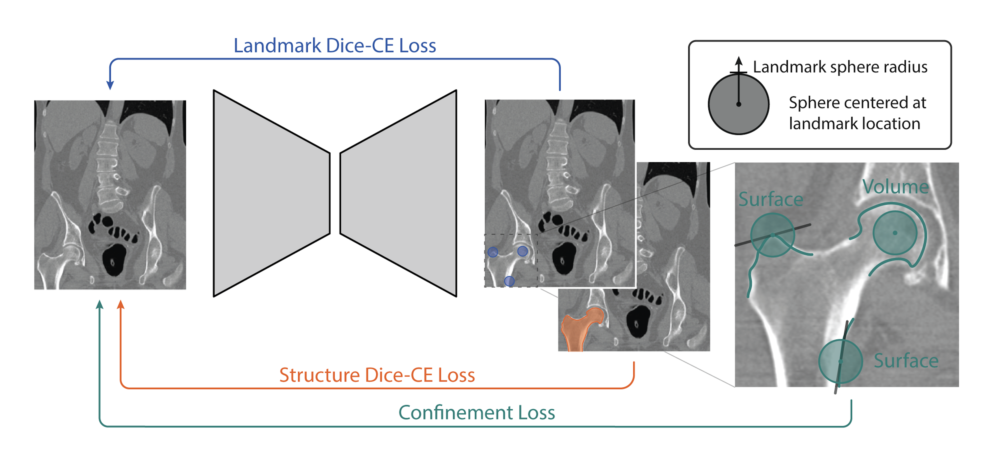

# Geometric confinement

Geometric confinement is landmark detection framework that formulates landmark detection as a segmentation problem, where the network predicts probability maps for each landmark using a Dice-CE objective. In addition to the main landmark detection task, two auxiliary constraints are introduced:

1. **Segmentation context:** an auxiliary anatomical structure segmentation task provides contextual information to guide landmark localization.
2. **Geometric confinement:** anatomy-based regularization losses constrain landmark probability maps according to expected spatial relationships with anatomical structures. Landmarks are encouraged to either overlap with target structures (volume confinement) or align with anatomical boundaries (surface confinement).



## Structure

### [Data](./Data/)

The `Data` directory is used to store the datasets in MSD format. 
Check the [Data documentation](./Data/README.md) for more details on the structure and setup.

*This directory is automatically selected as Data root when setting the environment variable `ROOT_DIR` to the root of this project.*

### [Models](./Models/)

The `Models` directory is used to store the trained models and results. 
Check the [Models documentation](./Models/README.md) for more details on the structure of the output models. 

*This directory is automatically selected as Models root when setting the environment variable `ROOT_DIR` to the root of this project.*

### Scripts

#### [Dataset](./Scripts/Dataset/)

Module, scripts, and configs for dataset preprocessing. 
Check the [Dataset documentation](./Scripts/Dataset/README.md) for more details.

#### [Landmark detection](./Scripts/LandmarkDetection/)

Module, scripts, and configs for model training. 
Check the [LandmarkDetection documentation](./Scripts/LandmarkDetection/README.md) for more details.

### Support

#### [Confinement analysis](./Support/confinement_analysis/)

A set of Python scripts that can be useful for the analysis of the methodology.
Most importantly, one can analyse the [geometric confinement functions](./Support/confinement_analysis/geoconf_function.py) for different target overlap and the half-overlap assumpation, and perform the calculation of [overlaps for each landmark-structure pair](./Support/confinement_analysis/landmark_segment_overlap.py) in a given dataset.
Check the [Confinement analysis documentation](./Support/confinement_analysis/README.md) for more details.

#### [Confinement datasets](./Support/confinement_datasets/)

A framework for structuring raw datasets, analysing the content of datasets, and preparing a dataset that can be used for landmark detection.
Check the [Confinement datasets documentation](./Support/confinement_datasets/README.md) for more details.

#### [Confinement results](./Support/confinement_results/)

A framework for the statistical analysis of the output models.
Check the [Confinement results documentation](./Support/confinement_results/README.md) for more details.

### Running with HPC

The shell file were used to run data preprocessing, training and evalutation on our HPC using slurm (NVIDIA A100 + 16-core AMD EPYC 7282).

- [dataset.sh](./dataset.sh)
- [test.sh](./test.sh)
- [time.sh](./time.sh)
- [train.sh](./train.sh)

## Environment

Python version 3.11.3

### Conda
```bash
conda create -n geometric_confinement python=3.11.3
conda activate geometric_confinement
python -m pip install --upgrade pip
python -m pip install -r requirements.txt
```

### Python venv

```bash
python -m venv .venv
source .venv/bin/activate
python -m pip install --upgrade pip
python -m pip install -r requirements.txt
```

## Publication

This work is planned for publishing in Shapes in Medical Imaging 2026 (ShapeMI2026), a workshop held in conjunction with MICCAI 2026.


## 

